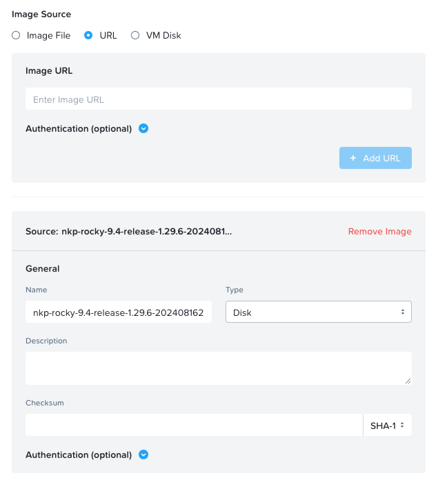

# Nutanix Kubernetes Platform - Quickstart Guide

## TL;DR

Steps to install all the required CLIs (nkp, kubectl and helm) to create and manage NKP clusters.

1. Add NKP Rocky Linux image from the Nutanix Support Portal to Prism Central

1. Create a jumphost with 2 vCPUs & 4 GB memory using the Rocky image and the following Cloud-init custom script

    ```yaml
    #cloud-config
    ssh_pwauth: true
    chpasswd:
      expire: false
      users:
      - name: nutanix
        password: nutanix/4u
        type: text
    runcmd:
    - mv /etc/yum.repos.d/nutanix_rocky9.repo /etc/yum.repos.d/nutanix_rocky9.repo.disabled
    - dnf config-manager --add-repo https://download.docker.com/linux/centos/docker-ce.repo
    - dnf -y install docker-ce docker-ce-cli containerd.io docker-compose-plugin
    - systemctl --now enable docker
    - usermod -aG docker nutanix
    - 'curl -LO https://storage.googleapis.com/kubernetes-release/release/$(curl -s https://storage.googleapis.com/kubernetes-release/release/stable.txt)/bin/linux/amd64/kubectl'
    - chmod +x ./kubectl
    - mv ./kubectl /usr/local/bin/kubectl
    - '\curl https://raw.githubusercontent.com/helm/helm/main/scripts/get-helm-3 | bash'
    ```

1. SSH to `nutanix@<JUMPHOST_IP>`

1. Install the CLIs with the command:

    ```shell
    curl -sL https://raw.githubusercontent.com/nutanixdev/nkp-quickstart/main/scripts/get-nkp-cli | bash
    ```

## Table of Contents

1. [Overview](#overview)

1. [Prerequisites Checklist](#prerequisites-checklist)

1. [Deploy Linux Jumphost](#deploy-linux-jumphost)

1. [Install NKP CLI](#install-nkp-cli)

1. [(Optional) Create NKP Cluster on Nutanix](#optional-create-nkp-cluster-on-nutanix)

## Overview

The NKP CLI is a command-line interface for managing NKP-based workflows. This guide provides a quick and easy way to install the required CLIs (nkp, kubectl and helm) using the Rocky Linux image provided by Nutanix in the [Nutanix Support Portal](https://portal.nutanix.com/page/downloads?product=nkp).

## Prerequisites Checklist

For NKP CLI:

- Internet connectivity
- Add NKP Rocky Linux to Prism Central. **DO NOT CHANGE** the auto-populated image name

    <details>
    <summary>click to view example</summary>
    
    </details>

(Optional) For NKP cluster creation:

- Static IP address for the control plane VIP
- One or more IP addresses for the NKP dashboard and load balancing service

## Deploy Linux Jumphost

1. Connect to Prism Central

1. Create a virtual machine

    - Name: nkp-jumphost
    - vCPUs: 2
    - Memory: 4
    - Disk: Clone from Image (select the Rocky Linux you previously uploaded)
    - Disk Capacity: 128 (default is 20)
    - Guest Customization: Cloud-init (Linux)
    - Custom Script:

        ```yaml
        #cloud-config
        ssh_pwauth: true
        chpasswd:
          expire: false
          users:
          - name: nutanix
            password: nutanix/4u
            type: text
        runcmd:
        - mv /etc/yum.repos.d/nutanix_rocky9.repo /etc/yum.repos.d/nutanix_rocky9.repo.disabled
        - dnf config-manager --add-repo https://download.docker.com/linux/centos/docker-ce.repo
        - dnf -y install docker-ce docker-ce-cli containerd.io docker-compose-plugin
        - systemctl --now enable docker
        - usermod -aG docker nutanix
        - 'curl -LO https://storage.googleapis.com/kubernetes-release/release/$(curl -s https://storage.googleapis.com/kubernetes-release/release/stable.txt)/bin/linux/amd64/kubectl'
        - chmod +x ./kubectl
        - mv ./kubectl /usr/local/bin/kubectl
        - '\curl https://raw.githubusercontent.com/helm/helm/main/scripts/get-helm-3 | bash'
        ```

    <details>
    <summary>click to view example</summary>
    
    </details>

1. Power on the virtual machine

## Install NKP CLI

1. Connect to your jumphost using SSH.

    ```shell
    ssh nutanix@<JUMPHOST_IP>
    ```

1. Download the latest NKP CLI release with the command:

    ```shell
    curl -sL https://raw.githubusercontent.com/nutanixdev/nkp-quickstart/main/scripts/get-nkp-cli | bash
    ```

    When prompted, you must use the download link AS-IS available in the Nutanix portal.

## (Optional) Create NKP cluster on Nutanix

## Support and Disclaimer

These code samples are intended as a standalone examples.  Please be aware that all public code samples provided by Nutanix are unofficial in nature, are provided as examples only, are unsupported and will need to be heavily scrutinized and potentially modified before they can be used in a production environment.  All such code samples are provided on an as-is basis, and Nutanix expressly disclaims all warranties, express or implied.  All code samples are © Nutanix, Inc., and are provided as-is under the MIT license (<https://opensource.org/licenses/MIT>).
