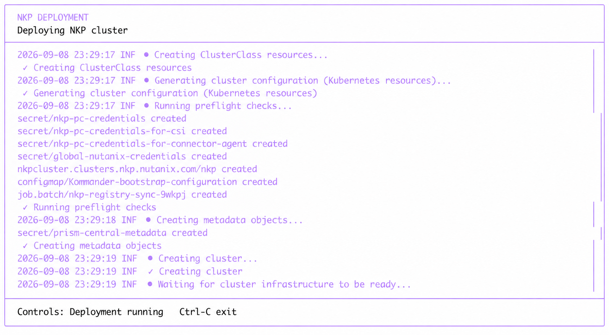

# Nutanix Kubernetes Platform - Quickstart Guide

## TL;DR

Steps to install all the required CLIs (nkp, kubectl and helm) to create and manage NKP clusters.

1. Add NKP Rocky Linux image from the Nutanix Support Portal to Prism Central

2. Create a jump host with 2 vCPUs, 8 GB memory, use the Rocky image (update disk to 128 GiB), and the following Cloud-init custom script : [cloud-init](./cloud-init)

3. SSH to `nutanix@<jump host_IP>` (default password: nutanix/4u - unless you modified it in the cloud-init file)

4. Install the NKP CLI with the command: [get-nkp-cli](./get-nkp-cli)

    When prompted, you must use the download link as-is, which is available in the Nutanix portal.

## Table of Contents

1. [Overview](#overview)

2. [Prerequisites Checklist](#prerequisites-checklist)

3. [Deploy Linux jump host](#deploy-linux-jump-host)

4. [Install NKP CLI](#install-nkp-cli)

5. [Create NKP Cluster on Nutanix](#create-nkp-cluster-on-nutanix)
   - [Scripted Automated Deployment](#scripted-automated-deployment-recommended)
   - [Prompt-based Installation](#prompt-based-installation)
   - [CLI Installation](#cli-installation)

## Overview

The NKP CLI is a command-line interface for managing NKP-based workflows. This guide provides a quick and easy way to install the required CLIs (nkp, kubectl and helm) using the Rocky Linux image provided by Nutanix in the [Nutanix Support Portal](https://portal.nutanix.com/page/downloads?product=nkp).

## NKP on Nutanix High level design

Below an example of NKP on Nutanix deployment diagram.
Ip ranges are provided as example.


## Prerequisites Checklist

For NKP CLI:

- Internet connectivity
- Add NKP Node OS Image Rocky Linux to Prism Central. **DO NOT CHANGE** the auto-populated image name

    

For NKP cluster creation:

- The target cluster must be running **AOS 7.3** and **Prism Central (PC) 7.3** or newer. [Check the Nutanix support portal to align NKP, AOS, and PC versions.](https://portal.nutanix.com/page/compatibility-interoperability-matrix/nkp/interoperability)
- **DHCP/IPAM** is required
- IP Addresses (must be reachable to jump host)
  - Static IP address for the control plane VIP
  - One or more IP addresses for the NKP dashboard and load balancing service

## Deploy Linux jump host

1. Connect to Prism Central

2. Create a virtual machine

    - Name: nkp-jump host
    - vCPUs: 4
    - Memory: 8
    - Disk: Clone from Image (select the Rocky Linux you previously uploaded)
    - Disk Capacity: 128 (default is 20)
    - Guest Customization: Cloud-init (Linux)
    - Custom Script: [cloud-init](./cloud-init)

3. Power on the virtual machine

## Install NKP CLI

1. Connect to your jump host using SSH (default password: nutanix/4u)

    ```shell
    ssh nutanix@<jump host_IP>
    ```

2. git clone this repo

    ```shell
    git clone https://github.com/nutanixdev/nkp-quickstart.git
    ```

3. Install the NKP CLI with the command: [get-nkp-cli](./get-nkp-cli)

    ```shell
    cd nkp-quickstart && ./get-nkp-cli
    ```

    When prompted, you must use the download link as-is, which is available in the Nutanix portal.

    

## Create NKP cluster on Nutanix

Before creating a cluster, ensure you meet the prerequisites:

- Static IP address for the control plane VIP (must be outside of IPAM scope)
- One or more IP addresses for the NKP dashboard and load-balancing service (must be outside of IPAM scope)
- IP addresses must be in the same subnet as the virtual machines
- Access to the Nutanix Support Portal to download the NKP Bundle


Choose one of the following installation methods based on your needs:

- [Scripted Automated Deployment](#scripted-automated-deployment-recommended)
- [Prompt-based Installation](#prompt-based-installation)
- [CLI Installation](#cli-installation)

### Scripted Automated Deployment (Recommended)

This is the guided deployment path for the jump host created from the repository's [cloud-init](./cloud-init) configuration. Run it from the cloned repository:

```shell
./nkpDeploy.sh
```

The application runs directly in the terminal with a full-screen, purple-themed interface. It does not require a separate TUI framework. Arrow keys and Enter are used for selections; text fields, masked password input, and the final Y/N confirmation are handled inside the same bordered interface. Use `Ctrl-C` to exit.

The script automatically runs inside a `tmux` session named `nkp-deploy` (installed by [cloud-init](./cloud-init)). If SSH disconnects, the deployment continues. Running `./nkpDeploy.sh` again attaches to the existing session instead of starting a second deployment. To intentionally discard a stale session, use `tmux kill-session -t nkp-deploy`.

<p align="center">
  
</p>

#### Run flow

1. **Preflight:** Checks dependencies, container runtime/cgroups, portal connectivity, the NKP bundle, and bundled CLI installation.

2. **Discovery:** Prompts for Prism Central credentials, then uses v4 APIs to populate the AHV cluster, network, storage container, and Rocky image selectors. The endpoint and username persist in `nkpDeploy_defaults.json`; the password is never saved.

3. **Configuration:** Uses the selected network CIDR to validate the control-plane VIP and load-balancer range. The load-balancer end address is calculated from the selected start address and count; replica counts use bounded selectors.

4. **Review and deploy:** Validates NKP, AOS, Prism Central, and Rocky-image compatibility, shows the final summary, waits for Y/N confirmation, and runs `nkp create cluster` inside the bordered interface.

#### NKP bundle download

The script reuses a local standard bundle when available. Otherwise, open the NKP release download page in the Nutanix Support Portal, copy the **standard NKP Bundle** link itself, and paste the complete URL—including any query string—into the prompt. Do not use the portal page URL, NKP CLI link, or Air-Gapped Bundle link.

#### Prism Central selections

The v4 API supplies selectors for the AHV cluster, network/CIDR, storage container, and versioned Rocky image. Enter the cluster name, network host portions, and node counts; the application validates and calculates the derived addresses.

The deployment typically takes 45–60 minutes. Once it completes, configure the generated kubeconfig and view the dashboard details:

```shell
export KUBECONFIG=$(pwd)/<cluster_name>.conf
nkp get dashboard
```

#### Compatibility data

Rules are stored in [`nkp_compatibility.json`](./nkp_compatibility.json). Each NKP release defines `nkp_version`, aligned AOS/Prism Central minimum-version lists, and supported Kubernetes minor versions. Add or update entries as new releases are approved; listing two Kubernetes minors supports the current version and one version back.

---

### Prompt-based Installation

This installation method provides an interactive deployment experience with less control over cluster configuration. The NKP cluster will be created with three control plane nodes and four worker nodes (default sizing).

**Use this method if:**

- You want a quick proof-of-concept deployment
- Default cluster sizing works for your use case
- You prefer interactive prompts over pre-configuration

We recommend starting a tmux session in case your ssh connection is at risk of disconnection (like laptop going into sleep mode) as the process can take some time based on several parameters (like download speed).

```shell
nkp create cluster nutanix
```

---

### CLI Installation

This installation method lets you fully customize your cluster configuration. The following commands create a cluster with one control plane node and three worker nodes.

**Use this method if:**

- You need non-standard cluster sizing
- You want to fine-tune every cluster parameter
- You're deploying multiple cluster variations
- You need full control and repeatability via configuration files

1. Before running the following command in your jump host VM, update the values with your environment: [nkp-env](./nkp-env)

2. The next command will start the installation process of an NKP management cluster: [nkp-create-cluster](./nkp-create-mgmt-cluster.sh)

---

## Comparison: Which Method Should I Use?

| Factor | Scripted | Prompt-Based | CLI |
| ------ | -------- | ------------ | --- |
| **Ease of Use** | ⭐⭐⭐⭐⭐ | ⭐⭐⭐⭐ | ⭐⭐⭐ |
| **Customization** | ⭐⭐⭐ | ⭐⭐ | ⭐⭐⭐⭐⭐ |
| **Version Validation** | Automatic | Manual | Manual |
| **Input Validation** | Comprehensive | Basic | None |
| **Time to Deploy** | 5-10 min setup | 10-15 min setup | Variable |
| **Best For** | New users, POCs | Quick tests | Advanced/Production |
| **Typical Use Case** | First deployment | Learning | Automation |

---

## Support and Disclaimer

These code samples are intended as standalone examples. Please be aware that all public code samples provided by Nutanix are unofficial in nature, are provided as examples only, are unsupported, and will need to be heavily scrutinized and potentially modified before they can be used in a production environment. All such code samples are provided on an as-is basis, and Nutanix expressly disclaims all warranties, express or implied. All code samples are © Nutanix, Inc., and are provided as-is under the MIT license (<https://opensource.org/licenses/MIT>).
