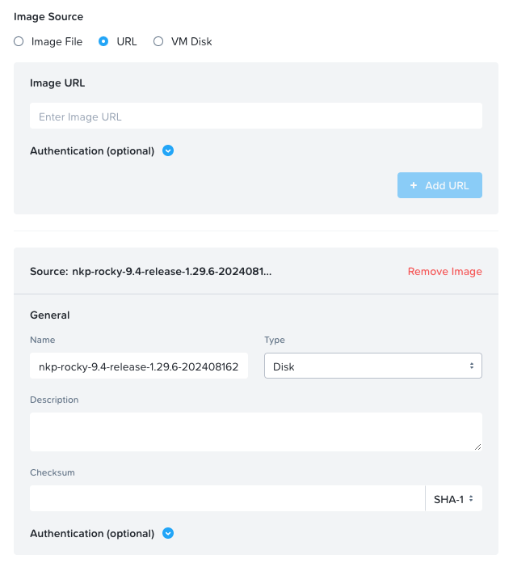
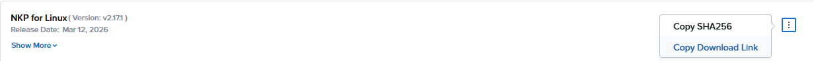
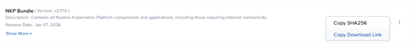
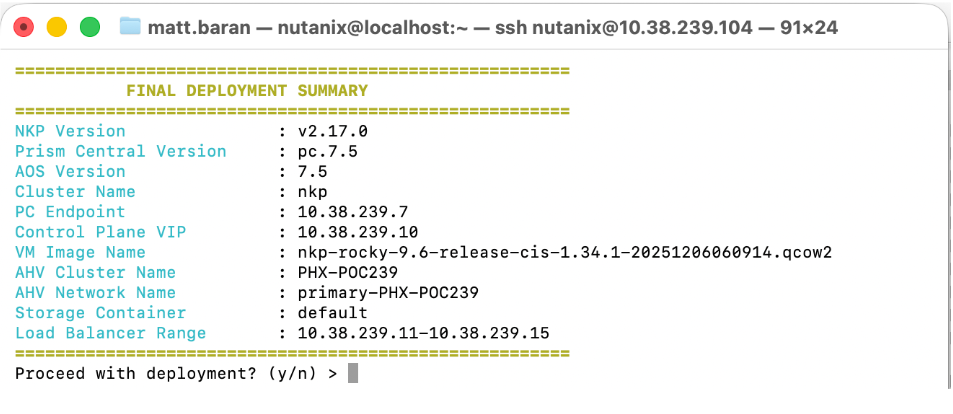

# Nutanix Kubernetes Platform - Quickstart Guide

## TL;DR

Steps to install all the required CLIs (nkp, kubectl and helm) to create and manage NKP clusters.

1. Add NKP Rocky Linux image from the Nutanix Support Portal to Prism Central

2. Create a jump host with 2 vCPUs, 8 GB memory, use the Rocky image (update disk to 128 GiB), and the following Cloud-init custom script : [cloud-init](./cloud-init)

3. SSH to `nutanix@<jump host_IP>` (default password: nutanix/4u - unless you modified it in the cloud-init file)

4. Install the NKP CLI with the command: [get-nkp-cli](./get-nkp-cli)

    When prompted, you must use the download link as-is, which is available in the Nutanix portal.

## Table of Contents

1. [Overview](#overview)

2. [Prerequisites Checklist](#prerequisites-checklist)

3. [Deploy Linux jump host](#deploy-linux-jump-host)

4. [Install NKP CLI](#install-nkp-cli)

5. [Create NKP Cluster on Nutanix](#create-nkp-cluster-on-nutanix)
   - [Scripted Automated Deployment](#scripted-automated-deployment-recommended)
   - [Prompt-based Installation](#prompt-based-installation)
   - [CLI Installation](#cli-installation)

## Overview

The NKP CLI is a command-line interface for managing NKP-based workflows. This guide provides a quick and easy way to install the required CLIs (nkp, kubectl and helm) using the Rocky Linux image provided by Nutanix in the [Nutanix Support Portal](https://portal.nutanix.com/page/downloads?product=nkp).

## NKP on Nutanix High level design

Below an example of NKP on Nutanix deployment diagram.
Ip ranges are provided as example.


## Prerequisites Checklist

For NKP CLI:

- Internet connectivity
- Add NKP Node OS Image Rocky Linux to Prism Central. **DO NOT CHANGE** the auto-populated image name

    

For NKP cluster creation:

- The target cluster must be running **AOS 7.3** and **Prism Central (PC) 7.3** or newer. [Check the Nutanix support portal to align NKP, AOS, and PC versions.](https://portal.nutanix.com/page/compatibility-interoperability-matrix/nkp/interoperability)
- **DHCP/IPAM** is required
- IP Addresses (must be reachable to jump host)
  - Static IP address for the control plane VIP
  - One or more IP addresses for the NKP dashboard and load balancing service

## Deploy Linux jump host

1. Connect to Prism Central

2. Create a virtual machine

    - Name: nkp-jump host
    - vCPUs: 4
    - Memory: 8
    - Disk: Clone from Image (select the Rocky Linux you previously uploaded)
    - Disk Capacity: 128 (default is 20)
    - Guest Customization: Cloud-init (Linux)
    - Custom Script: [cloud-init](./cloud-init)

3. Power on the virtual machine

## Install NKP CLI

1. Connect to your jump host using SSH (default password: nutanix/4u)

    ```shell
    ssh nutanix@<jump host_IP>
    ```

2. git clone this repo

    ```shell
    git clone https://github.com/nutanixdev/nkp-quickstart.git
    ```

3. Install the NKP CLI with the command: [get-nkp-cli](./get-nkp-cli)

    ```shell
    cd nkp-quickstart && ./get-nkp-cli
    ```

    When prompted, you must use the download link as-is, which is available in the Nutanix portal.

    

## Create NKP cluster on Nutanix

Before creating a cluster, ensure you meet the prerequisites:

- Static IP address for the control plane VIP (must be outside of IPAM scope)
- One or more IP addresses for the NKP dashboard and load-balancing service (must be outside of IPAM scope)
- IP addresses must be in the same subnet as the virtual machines
- Access to the Nutanix Support Portal to download the NKP Bundle



Choose one of the following installation methods based on your needs:

- [Scripted Automated Deployment](#scripted-automated-deployment-recommended)
- [Prompt-based Installation](#prompt-based-installation)
- [CLI Installation](#cli-installation)

### Scripted Automated Deployment (Recommended)

#### NEW: See how it works! - https://nutanix.storylane.io/share/nkp-quickstart

This method guides you through the entire deployment process interactively with automatic validation and error checking. It's ideal for first-time users and provides:

- ✅ **Modern terminal selections** - Uses a color keyboard-driven picker to select the AHV cluster, network, storage container, and VM image directly from Prism Central
- ✅ **CIDR-aware network prompts** - Prefills the selected network prefix and validates the control-plane VIP and load-balancer range against its actual mask
- ✅ **Automated system prerequisite validation** - Checks and configures cgroup v2 delegation automatically
- ✅ **Smart NKP Bundle management** - Auto-detects existing bundles, downloads if needed, extracts binaries
- ✅ **Prism Central version compatibility checks** - Prevents incompatible deployments before they start
- ✅ **Comprehensive input validation** - Validates IP ranges, cluster names, and subnet alignment
- ✅ **Network connectivity verification** - Ensures outbound access to Nutanix portal
- ✅ **Pre-flight summary review** - Shows all parameters and requires explicit confirmation

**Use this method if:**

- You want a guided, hands-off deployment experience
- This is your first NKP deployment
- You want automatic compatibility validation to prevent mid-deployment failures
- You prefer interactive prompts over manual configuration files

**Steps:**

1. From your cloned repository run the script to begin:

    ```shell
    ./nkpDeploy.sh
    ```

2. The script will verify prerequisites, collect the Prism Central IP/user/password, and then load selectable values from the Prism Central v4 APIs:

    | Parameter | Description | Example |
    | --------- | ----------- | ------- |
    | **Prism Central Endpoint** | IP address of Prism Central | `10.0.0.10` |
    | **Prism Username** | Your Prism Central username | `admin` |
    | **Prism Password** | Your Prism Central password | *(masked input)* |
    | **AHV Cluster Name** | Select the target AHV cluster | `PHX-Cluster-1` |
    | **Network Name** | Select the node network; its CIDR is shown | `Management [10.0.0.0/24]` |
    | **Storage Container** | Select the storage container for persistent volumes | `SelfServiceContainer` |
    | **VM Image Name** | Select the NKP Rocky image from Prism Central | `nkp-rocky-9.6-release-cis-1.34.1...qcow2` |
    | **Cluster Name** | Desired NKP cluster name (lowercase) | `prod-cluster` |
    | **Control Plane VIP** | Static IP for control plane (prefilled with network prefix) | `10.0.0.50` |
    | **LB IP Range** | Load balancer range (prefilled with network prefix) | `10.0.0.100-10.0.0.110` |
    | **Control Plane Replicas** | Number of control plane nodes (1-5, default: 1) | `1` |
    | **Worker Replicas** | Number of worker nodes (1-10, default: 3) | `3` |

3. Review the final deployment summary and confirm to proceed.

    

4. The deployment typically takes 45-60 minutes. Once complete, configure your kubeconfig:

    ```shell
    export KUBECONFIG=$(pwd)/<cluster_name>.conf
    nkp get dashboard
    ```

    This will display the Kommander dashboard URL and login credentials.

#### What the Script Does

- **Dependency Check:** Verifies `curl`, `jq`, and `tar`; the modern keyboard picker and prompts use ANSI terminal controls without an additional UI dependency
- **Prism Central Discovery:** Uses the v4 cluster, networking/subnet, storage-container, and image APIs to populate the selectable values
- **System Prerequisites:** Checks/configures cgroup v2 delegation (may require reboot)
- **Connectivity Check:** Verifies outbound access to Nutanix portal
- **Bundle Management:** Looks for existing bundle, prompts for download URL if needed, extracts binaries
- **Binary Installation:** Installs `nkp` and `kubectl` to `/usr/local/bin`
- **Configurable Sizing:** Allows custom control plane and worker replica counts (optional, has defaults)
- **Version Validation:** Queries Prism Central API to confirm PC and AOS versions > 7.3
- **Input Validation:** Ensures all parameters are correctly formatted and compatible
- **Deployment:** Executes the `nkp create cluster` command with validated parameters and custom sizing

---

### Prompt-based Installation

This installation method provides an interactive deployment experience with less control over cluster configuration. The NKP cluster will be created with three control plane nodes and four worker nodes (default sizing).

**Use this method if:**

- You want a quick proof-of-concept deployment
- Default cluster sizing works for your use case
- You prefer interactive prompts over pre-configuration

We recommend starting a tmux session in case your ssh connection is at risk of disconnection (like laptop going into sleep mode) as the process can take some time based on several parameters (like download speed).

```shell
nkp create cluster nutanix
```

---

### CLI Installation

This installation method lets you fully customize your cluster configuration. The following commands create a cluster with one control plane node and three worker nodes.

**Use this method if:**

- You need non-standard cluster sizing
- You want to fine-tune every cluster parameter
- You're deploying multiple cluster variations
- You need full control and repeatability via configuration files

1. Before running the following command in your jump host VM, update the values with your environment: [nkp-env](./nkp-env)

2. The next command will start the installation process of an NKP management cluster: [nkp-create-cluster](./nkp-create-mgmt-cluster.sh)

---

## Comparison: Which Method Should I Use?

| Factor | Scripted | Prompt-Based | CLI |
| ------ | -------- | ------------ | --- |
| **Ease of Use** | ⭐⭐⭐⭐⭐ | ⭐⭐⭐⭐ | ⭐⭐⭐ |
| **Customization** | ⭐⭐⭐ | ⭐⭐ | ⭐⭐⭐⭐⭐ |
| **Version Validation** | Automatic | Manual | Manual |
| **Input Validation** | Comprehensive | Basic | None |
| **Time to Deploy** | 5-10 min setup | 10-15 min setup | Variable |
| **Best For** | New users, POCs | Quick tests | Advanced/Production |
| **Typical Use Case** | First deployment | Learning | Automation |

---

## Support and Disclaimer

These code samples are intended as standalone examples. Please be aware that all public code samples provided by Nutanix are unofficial in nature, are provided as examples only, are unsupported, and will need to be heavily scrutinized and potentially modified before they can be used in a production environment. All such code samples are provided on an as-is basis, and Nutanix expressly disclaims all warranties, express or implied. All code samples are © Nutanix, Inc., and are provided as-is under the MIT license (<https://opensource.org/licenses/MIT>).
